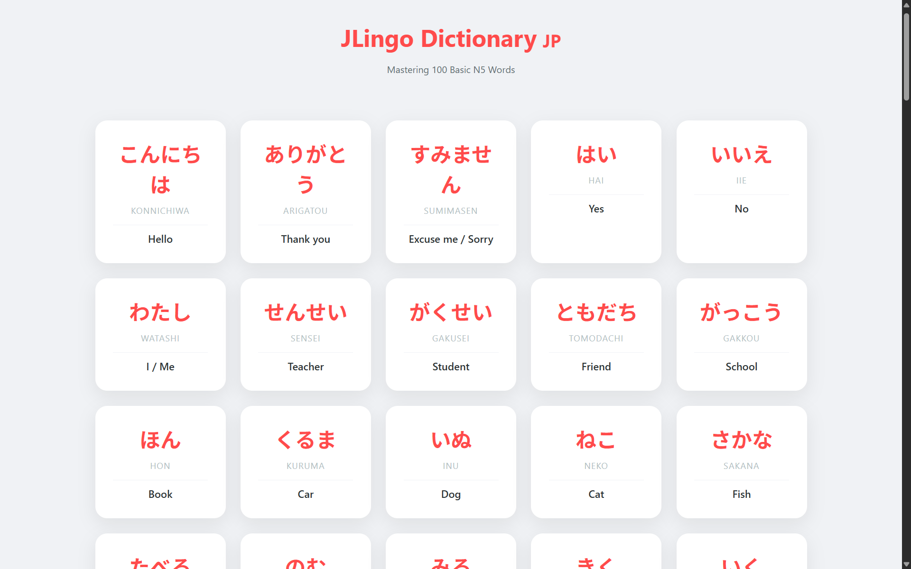

# JLingo 🇯🇵

JLingo  Japanese dictionary application built with **Spring Boot**. It is  JLPT N5 vocabulary through a clean, visually appealing web interface.

📸 Screenshots
**

## 🚀 Features

- **Hiragana-First Design**.
- **Implements a decoupled Service layer for data management**.
- **Vocabulary is stored in an external `words.json` file, allowing for easy updates without touching Java code**.
- **A modern, card-based grid layout with smooth hover effects.**
- **100+ N5 Words: Pre-loaded with essential greetings, verbs, adjectives, and numbers.**

## 🛠️ Tech Stack

- **Backend:** Java 21, Spring Boot 4.0.6
- **Frontend:** HTML5, CSS3 (Modern Grid/Flexbox), JavaScript (Fetch API)
- **Data:** JSON (Jackson-based parsing)
- **Build Tool:** Maven

## 📂 Project Structure

```text
src/
├── main/
│   ├── java/com/example/newborn/
│   │   ├── JLingoApplication.java  # Main Controller & Entry Point
│   │   ├── DictionaryService.java  # JSON Data Logic
│   │   └── Word.java               # Data Model
│   └── resources/
│       ├── static/
│       │   └── index.html          # Web Frontend
│       └── words.json              # Vocabulary Database